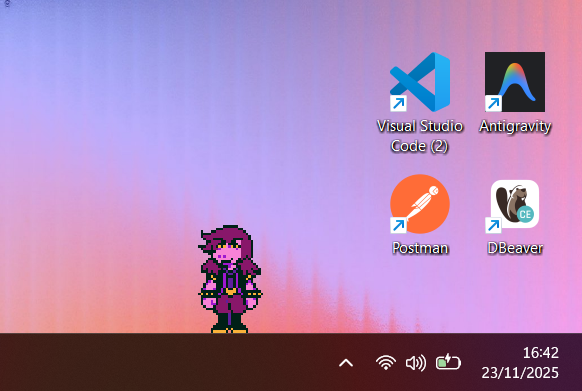
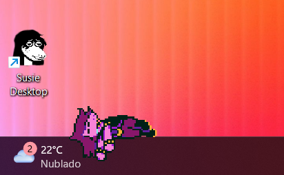
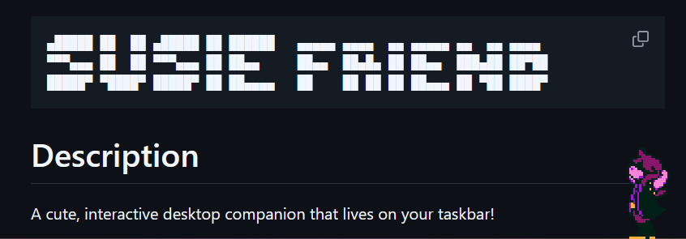
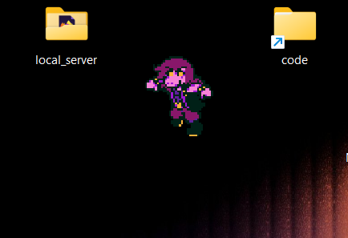

```
▄█████ ██  ██ ▄█████ ██ ██████   ▄▄▄▄▄ ▄▄▄▄  ▄▄ ▄▄▄▄▄ ▄▄  ▄▄ ▄▄▄▄
▀▀▀▄▄▄ ██  ██ ▀▀▀▄▄▄ ██ ██▄▄     ██▄▄  ██▄█▄ ██ ██▄▄  ███▄██ ██▀██
█████▀ ▀████▀ █████▀ ██ ██▄▄▄▄   ██    ██ ██ ██ ██▄▄▄ ██ ▀██ ████▀
```

# Description

A cute, interactive desktop companion that lives on your taskbar!

Susie is a pixel-art character from Deltarune who walks, sleeps, stretches, and interacts with your desktop environment. She is designed to be a lightweight, fun presence on your screen.

> 📸 Check out the [Screenshots](#screenshots) section below to see Susie in action!

## Features

- **Autonomous Behavior**: Susie walks around your screen, changing direction randomly or when hitting edges.
- **Idle States**:
  - **Standing**: Sometimes she just stops and looks around.
  - **Sleeping**: She gets tired and takes a nap.
  - **Stretching**: She stretches to stay limber.
- **Interactive**:
  - **Drag & Drop**: Pick her up and move her anywhere! She'll dangle helplessly until you drop her.
  - **Gravity**: Drop her and watch her fall back to the bottom of the screen.
- **Optimized**:
  - **Lightweight**: Low CPU and Memory usage (optimized rendering loop).
  - **Non-Intrusive**: Stays on top of the taskbar but doesn't block your work.
  - **System Tray**: Control the app via the system tray icon.

## Tech Stack

- **Electron**: For the desktop application shell.
- **Vanilla JavaScript**: For the game loop and logic (no heavy frameworks).
- **CSS3**: For animations and sprite rendering.

## How to Run

1.  **Install Dependencies**:

    ```bash
    npm install
    ```

2.  **Start the App**:
    ```bash
    npm start
    ```

## Credits

Made with by **Jordão Quirino** for **Leli**.

---

## Screenshots

Here's Susie showing off her different states:

### Standing

### Standing



### Sleeping



### Stretching



### Falling



---

_Note: This project is a personal gift and a fun experiment in desktop pets._
